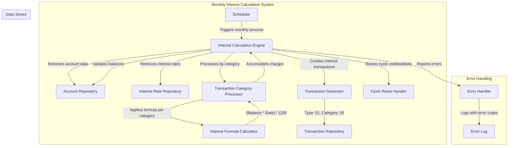

# Monthly Credit Card Interest Calculation

## User Story
_As a credit card account manager, I want the system to automatically calculate and apply monthly interest charges based on transaction categories and account types, so that customers are billed accurately according to their account terms and balances._

## Acceptance Criteria
1. GIVEN an account with outstanding balances WHEN the monthly interest calculation process runs THEN interest charges should be calculated per transaction category using the formula: (Transaction Category Balance * Interest Rate) / 1200
2. GIVEN an account with multiple transaction categories WHEN interest is calculated THEN each category should be processed separately with its applicable interest rate
3. GIVEN an account without a specific interest rate for its group/transaction type/category WHEN interest calculation occurs THEN the system should use the default interest rate with 'DEFAULT' as the account group ID
4. GIVEN an account with calculated interest charges WHEN the process completes THEN the account's current balance should be updated with the accumulated interest charges
5. GIVEN an account with calculated interest charges WHEN the process completes THEN transaction records with type code '01' and category code '05' should be created for each interest charge
6. GIVEN an account that has been processed WHEN all transaction categories are calculated THEN the cycle credits and debits should be reset to zero
7. GIVEN any file operation error WHEN the process runs THEN appropriate error handling should occur with specific error codes and messages

## Test Scenarios
1. Verify that interest is correctly calculated for an account with a $1000 balance and 18% interest rate, resulting in a $15 monthly interest charge
2. Confirm the system correctly processes multiple transaction categories within the same account with different interest rates
3. Validate that when a specific interest rate is not found for an account group/transaction type/category, the system falls back to the default interest rate
4. Verify that after processing all transaction categories for an account, the total interest is correctly added to the current balance
5. Confirm that transaction records are properly created for each interest charge with type code '01' and category code '05'
6. Validate that cycle credits and debits are reset to zero after an account is fully processed
7. Verify error handling when the transaction category balance file is unavailable or corrupted
8. Test the system's behavior when processing accounts with zero balances in some or all transaction categories
9. Confirm the system correctly processes the last account in the file sequence

## Diagram

## Subtasks
### Interest Calculation Processing
This subtask processes transaction category balances and calculates monthly interest charges for credit card accounts. The program reads account balances from an indexed file, retrieves applicable interest rates from a disclosure group file, calculates interest, updates account balances, and generates interest transaction records. Key business rules include:

1. Interest is calculated per transaction category and transaction type within each account
2. Formula: Monthly Interest = (Transaction Category Balance * Interest Rate) / 1200
   Example: For a balance of $1000 with 18% interest rate: ($1000 * 18) / 1200 = $15 monthly interest
3. If a specific interest rate for an account group/transaction type/category isn't found, the system falls back to a default interest rate using 'DEFAULT' as the account group ID
4. Interest calculations are accumulated per account and added to the current balance
5. The program processes accounts sequentially, updating each account's balance after processing all its transaction categories
6. For each interest charge, a transaction record is created with type code '01' and category code '05'
7. The program resets cycle credits and debits to zero after processing an account
8. Comprehensive error handling for all file operations with specific error codes and messages
9. Dependencies: Requires transaction category balance file (TCATBALF), account cross-reference file (XREFFILE), disclosure group file (DISCGRP), account master file (ACCTFILE), and transaction output file (TRANSACT)
#### References
- [CBACT04C](/CBACT04C.md)