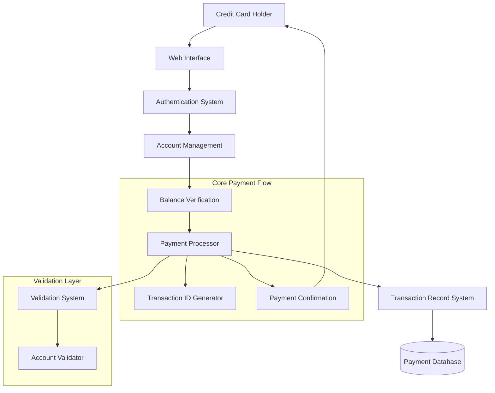

# Online Credit Card Bill Payment

## User Story
_As a credit card holder, I want to pay my credit card bill in full online, so that I can conveniently settle my outstanding balance without visiting a branch._

## Acceptance Criteria
1. GIVEN I am logged into my credit card account WHEN I have a positive balance AND I select the 'Pay in Full' option THEN I should see my current balance amount displayed for payment
2. GIVEN I am on the payment confirmation screen WHEN I confirm the payment by selecting 'Y' THEN the system should process my payment, reduce my balance to zero, and provide a confirmation with a unique transaction ID
3. GIVEN I attempt to make a payment WHEN my account has zero or negative balance THEN the system should reject the payment with the message 'You have nothing to pay...'
4. GIVEN I am making a payment WHEN I enter an empty or invalid account ID THEN the system should display an appropriate error message and position the cursor at the error field
5. GIVEN I am on the payment confirmation screen WHEN I enter anything other than 'Y', 'y', 'N', 'n' or leave it blank THEN the system should reject the input and prompt me again
6. System should generate a unique transaction ID for each successful payment by incrementing the highest existing transaction ID by 1
7. System should create a permanent record of each payment transaction with account details, amount, date, and transaction ID
8. Feature must validate account existence before allowing payment processing

## Test Scenarios
1. Verify that a user can successfully pay their credit card balance in full when they have a positive balance and confirm with 'Y'
2. Verify that after successful payment, the account balance is reduced to zero
3. Confirm the system generates and displays a unique transaction ID after successful payment
4. Verify that payment is rejected with appropriate message when account balance is zero or negative
5. Confirm payment is rejected when user enters an empty account ID with message 'Acct ID can NOT be empty...'
6. Verify payment is rejected when user enters a non-existent account ID with message 'Account ID NOT found...'
7. Validate that only 'Y', 'y', 'N', 'n' or blank are accepted at the confirmation prompt
8. Verify that file access errors during transaction processing are handled with appropriate error messages
9. Confirm the system handles duplicate transaction IDs with the message 'Tran ID already exist...'
10. Validate that transaction records contain accurate timestamp information from the system

## Diagram

## Subtasks
### Online Bill Payment Processing
This subtask enables users to pay their credit card balance in full through an online interface. The process includes:

1. Business Rules:
   - Account validation: Verifies the account exists before processing payment
   - Balance verification: Checks that the account has a positive balance to pay (if balance <= 0, payment is rejected with message 'You have nothing to pay')
   - User confirmation: Requires explicit confirmation ('Y') before processing payment
   - Transaction recording: Creates a permanent record of the payment with a unique transaction ID
   - Balance update: Reduces the account balance to zero after successful payment

2. Calculations:
   - Transaction ID generation: Reads the highest existing transaction ID and increments it by 1
   - Balance adjustment: COMPUTE ACCT-CURR-BAL = ACCT-CURR-BAL - TRAN-AMT
     Example: If current balance is $500.00, after payment ACCT-CURR-BAL = $500.00 - $500.00 = $0.00

3. Edge Cases:
   - Empty account ID: Rejected with error message 'Acct ID can NOT be empty...'
   - Account not found: Rejected with error message 'Account ID NOT found...'
   - Zero or negative balance: Rejected with message 'You have nothing to pay...'
   - Invalid confirmation value: Only 'Y', 'y', 'N', 'n' or blank are accepted

4. Error Handling:
   - File access errors: Provides specific error messages for read/write failures
   - Duplicate transaction ID: Handles with message 'Tran ID already exist...'
   - Invalid user inputs: Provides contextual error messages and positions cursor at error field

5. Dependencies:
   - Requires access to three files: TRANSACT (transaction records), ACCTDAT (account data), and CXACAIX (account cross-reference)
   - Integrates with system timestamp functions for transaction dating
   - Uses common screen handling and navigation components
#### References
- [COBIL00C](/COBIL00C.md)