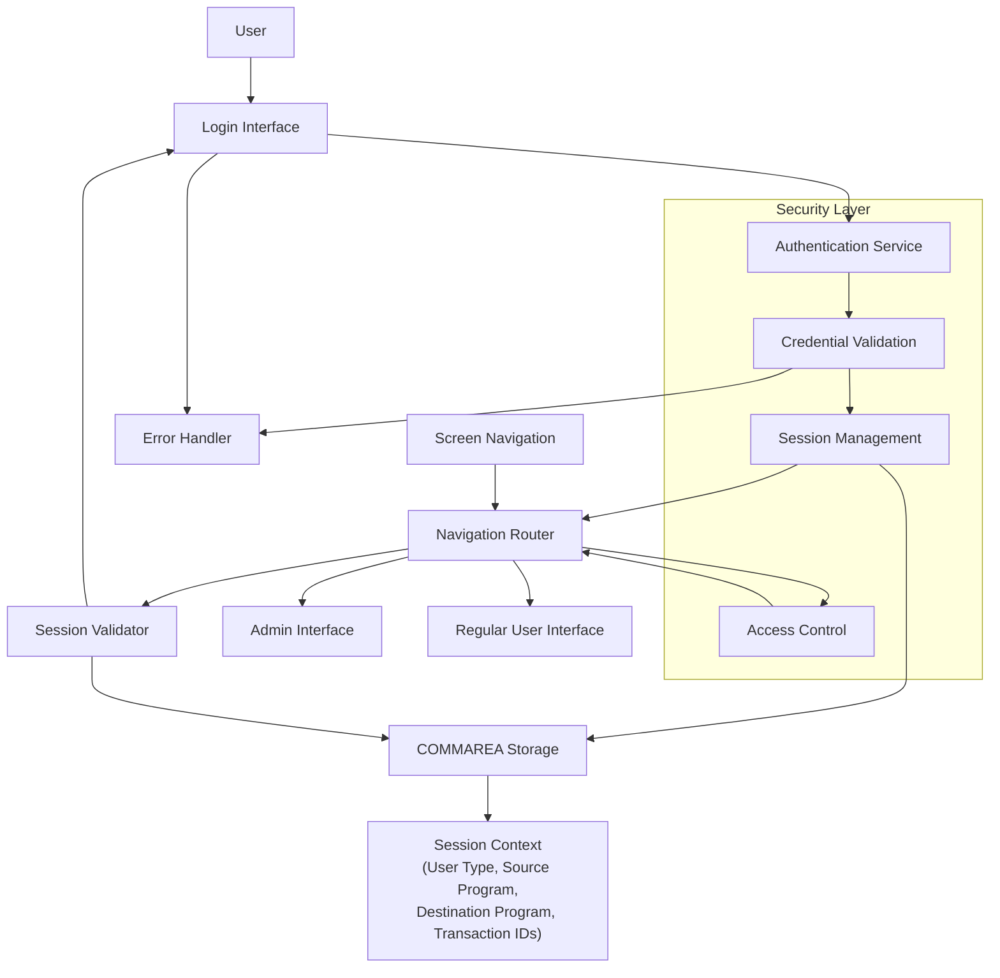

# Secure User Authentication and Session Management

## User Story
_As a CardDemo application user, I want to securely log in and maintain my session context throughout my interaction with the system, so that I can access appropriate functionality based on my user role without repeatedly authenticating._

## Acceptance Criteria
1. GIVEN I am at the login screen WHEN I enter valid credentials THEN I should be directed to the appropriate menu based on my user type (admin or regular user)
2. GIVEN I am at the login screen WHEN I enter invalid or empty credentials THEN I should see appropriate error messages
3. GIVEN I am logged in WHEN I navigate between different screens THEN my session context should be maintained
4. GIVEN I attempt to access a program directly WHEN I don't have a valid session context THEN I should be redirected to the sign-on program
5. System should convert user IDs to uppercase before validation while maintaining case-sensitivity for passwords
6. System should store session information in the COMMAREA including user type, source program, destination program, and transaction IDs
7. Feature must prevent unauthorized access to administrative functions by validating proper session context

## Test Scenarios
1. Verify that an admin user is directed to COADM01C when logging in with valid credentials
2. Verify that a regular user is directed to COMEN01C when logging in with valid credentials
3. Verify that appropriate error messages are displayed for: empty user ID, empty password, incorrect password, non-existent user, and system errors
4. Confirm session context is properly maintained when navigating between multiple screens
5. Validate that direct access to programs without proper context (EIBCALEN = 0) results in redirection to COSGN00C
6. Verify that user IDs are properly converted to uppercase during the authentication process
7. Confirm that passwords remain case-sensitive and must match exactly what's stored in the USRSEC file
8. Validate that all required session information (CDEMO-TO-PROGRAM, CDEMO-FROM-TRANID, CDEMO-FROM-PROGRAM) is correctly passed through the COMMAREA

## Diagram

## Subtasks
### User Login Processing
Manages the authentication process for users accessing the CardDemo application. The component validates user credentials against a security file (USRSEC) and routes authenticated users to the appropriate program based on their user type. Business rules include: (1) User ID and password fields cannot be empty - validation occurs before attempting authentication, (2) User IDs are converted to uppercase before validation, (3) Passwords are case-sensitive and must match exactly what's stored in the security file, (4) After successful authentication, admin users (CDEMO-USRTYP-ADMIN) are directed to the admin menu (COADM01C) while regular users are directed to the general user menu (COMEN01C), (5) User context information is passed through a communication area to maintain session state. Error handling includes specific messages for: empty user ID ('Please enter User ID...'), empty password ('Please enter Password...'), incorrect password ('Wrong Password. Try again...'), non-existent user ('User not found. Try again...'), and system errors ('Unable to verify the User...'). The component depends on the USRSEC file for user credential storage and verification.
#### References
- [COSGN00C](/COSGN00C.md)
### Session Context Management
This subtask manages the program flow and session context within the CardDemo application. It handles the communication between different screens through the COMMAREA, maintaining state across screen transitions. The component implements logic to detect first-time entry versus re-entry to the program, initializing the screen on first entry and processing user input on subsequent entries. When navigating away from this screen, it preserves context by setting up the destination program ID (CDEMO-TO-PROGRAM), source transaction ID (CDEMO-FROM-TRANID), and source program (CDEMO-FROM-PROGRAM) in the communication area. If a user attempts to access this program without proper context (EIBCALEN = 0), it redirects to the sign-on program (COSGN00C). This ensures proper application flow and security by preventing direct access to administrative functions without going through the proper channels.
#### References
- [COUSR01C](/COUSR01C.md)