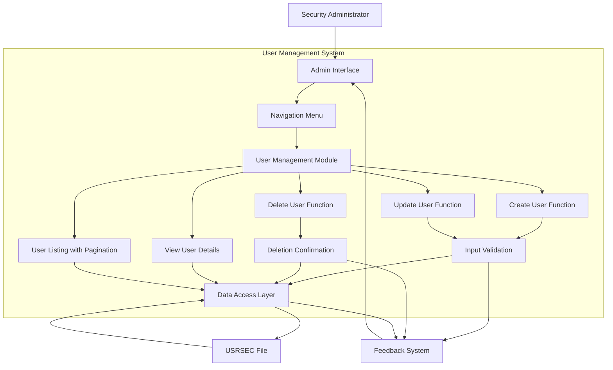

# Security Administration Interface for User Management

## User Story
_As a security administrator, I want a comprehensive interface to manage user accounts (create, update, delete, and list), so that I can efficiently maintain user access and security within the CardDemo application._

## Acceptance Criteria
1. GIVEN I am on the security administration screen WHEN I navigate to user management THEN I should see options for adding, updating, deleting, and listing users
2. GIVEN I am adding or updating a user WHEN I submit incomplete information THEN appropriate error messages should display and the cursor should position at the error field
3. GIVEN I am viewing user details WHEN I enter a valid user ID THEN the system should display the user's first name, last name, and user type
4. GIVEN I am deleting a user WHEN I enter a valid user ID THEN the system should display the user's details and require confirmation before deletion
5. GIVEN I am viewing the user listing WHEN there are more than 10 users THEN pagination controls should allow navigation through the complete list
6. GIVEN I am on any user management screen WHEN I press PF3 THEN I should return to the admin menu
7. GIVEN I am on any input form WHEN I press PF4 THEN all fields should be cleared
8. GIVEN I am updating a user WHEN I make no changes and attempt to save THEN the system should notify me that modifications are required
9. GIVEN I am updating or deleting a user WHEN I enter a non-existent user ID THEN an appropriate error message should display
10. System should display color-coded messages (green for success, red for errors) to provide clear visual feedback
11. Feature must maintain data integrity by validating all required fields before committing changes to the USRSEC file

## Test Scenarios
1. Verify that all required user interface elements (headers, function key descriptions, fields) are displayed correctly on each screen
2. Verify that validation errors are displayed when submitting forms with missing required fields (user ID, first name, last name, password, user type)
3. Confirm the cursor is positioned at the appropriate field when validation errors occur
4. Validate that user records can be successfully created with all required information
5. Verify that user details are correctly displayed when a valid user ID is entered for update or deletion
6. Confirm that user deletion requires explicit confirmation via PF5 key to prevent accidental deletions
7. Verify that the user listing displays up to 10 users per page with correct pagination using PF7/PF8 keys
8. Validate that selecting a user with 'U' or 'D' from the listing navigates to the correct update or delete screen
9. Confirm that PF3 returns to the admin menu from any screen in the user management workflow
10. Verify that PF4 clears all input fields on applicable screens
11. Validate that attempting to update a user without making changes results in an appropriate message
12. Verify that success messages are displayed in green and error messages in red
13. Confirm the system handles edge cases such as non-existent user IDs, empty user lists, and navigation beyond list boundaries
14. Verify that date is displayed in MM/DD/YY format and time in HH:MM:SS format in the header

## Diagram

## Subtasks
### User Interface Management
This subtask manages the user interface for the security administration function, specifically for adding new users. It handles screen rendering, field population, cursor positioning, and error message display. The interface includes header information with application titles, transaction ID, program name, current date (MM/DD/YY format), and time (HH:MM:SS format). The component provides clear visual feedback through color-coded messages (success messages in green) and positions the cursor at appropriate fields based on the context (e.g., at the error field when validation fails or at the first name field when initializing). The interface supports function keys for navigation: Enter to process the form, PF3 to return to the admin menu, and PF4 to clear all fields. Error messages are prominently displayed to guide administrators through the user creation process. This subtask depends on BMS map COUSR1A for screen layout and field definitions.
#### References
- [COUSR01C](/COUSR01C.md)
- [COUSR02C](/COUSR02C.md)
### User Record Deletion
This subtask handles the deletion of user records from the USRSEC security file. It allows administrators to remove user accounts from the system when they are no longer needed. The process includes: (1) Displaying a screen where administrators can enter a user ID to delete, (2) Retrieving and displaying the user's details for verification before deletion, and (3) Executing the deletion upon confirmation. Business rules include: Users must be identified by a valid, non-empty user ID; the system verifies the user exists before allowing deletion; and confirmation is required via PF5 key to prevent accidental deletions. Error handling includes specific messages for empty user ID fields ('User ID can NOT be empty...'), non-existent users ('User ID NOT found...'), and file access issues ('Unable to lookup User...' or 'Unable to Update User...'). The component depends on the USRSEC file for user data storage and integrates with other administrative components through the common communication area, particularly with COADM01C (admin menu) and potentially other user management screens.
#### References
- [COUSR03C](/COUSR03C.md)
### User Information Display
This subtask retrieves and displays user information before deletion to ensure administrators can verify they are deleting the correct user. When an administrator enters a user ID, the system reads the USRSEC file to retrieve the user's first name, last name, and user type, displaying these details on screen. This allows administrators to confirm they have the correct user before proceeding with deletion. The system handles edge cases such as non-existent user IDs by displaying an appropriate error message ('User ID NOT found...') and preventing deletion of non-existent records. The component depends on the USRSEC file for retrieving user data and uses a READ with UPDATE option to lock the record before deletion.
#### References
- [COUSR03C](/COUSR03C.md)
### User Profile Update
This subtask allows administrators to update existing user profiles in the CardDemo application. It retrieves user records from the USRSEC file based on user ID input, displays current information for editing, validates the modified data, and updates the user record. Business rules include: (1) Required fields validation - user ID, first name, last name, password, and user type cannot be empty; (2) Record existence validation - the system verifies the user ID exists before allowing updates; (3) Change detection - the system only processes updates when actual changes are made to the user profile; (4) The system provides visual feedback with color-coded messages (green for success, red for errors, neutral for informational); (5) Error handling for various scenarios including record not found conditions (e.g., 'User ID NOT found...') and update failures (e.g., 'Unable to Update User...'); (6) Navigation capabilities allow returning to previous screens (PF3/PF12), clearing input fields (PF4), and saving updates (PF5). Dependencies include the USRSEC file for user security data storage and integration with the admin menu system (COADM01C) for navigation.
#### References
- [COUSR02C](/COUSR02C.md)
### User Data Validation
This subtask handles the validation of user data during the update process. It enforces data integrity rules before allowing updates to be committed to the USRSEC file. Business rules include: (1) Field presence validation - checks that all required fields (user ID, first name, last name, password, user type) contain values; (2) Specific error messages are displayed for each validation failure (e.g., 'User ID can NOT be empty...', 'First Name can NOT be empty...'); (3) Cursor positioning - when validation fails, the cursor is automatically positioned at the field that needs correction (using the -1 indicator for field length attributes); (4) The system prevents updates when no changes are detected, displaying 'Please modify to update...' message; (5) Error handling includes user-friendly messages and appropriate cursor positioning to guide the administrator through the correction process. This validation ensures that user security records maintain consistent and complete data, which is critical for the authentication and authorization processes within the application.
#### References
- [COUSR02C](/COUSR02C.md)
### User Listing Management
This subtask provides a paginated interface for viewing and selecting users from the USRSEC file. It displays up to 10 users per page with their IDs, names, and user types. Business rules include: (1) Navigation through user records using PF7 (page up) and PF8 (page down) keys, with appropriate messaging when at the top or bottom of the list; (2) Maintaining pagination state between screens with first and last user IDs tracked in CDEMO-CU00-USRID-FIRST and CDEMO-CU00-USRID-LAST; (3) Support for user selection via 'U' (update) or 'D' (delete) options, which transfers control to COUSR02C or COUSR03C respectively; (4) Error handling for invalid selections with appropriate error messages; (5) Cursor positioning to guide user interaction; (6) Dependency on the USRSEC file for user data retrieval using STARTBR, READNEXT, READPREV, and ENDBR CICS commands. The component handles edge cases such as empty user lists, navigation beyond list boundaries, and invalid selection inputs.
#### References
- [COUSR00C](/COUSR00C.md)