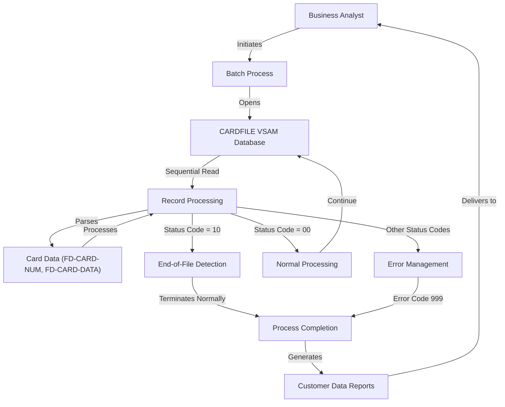

# Sequential Card Data File Reading for Reporting

## User Story
_As a business analyst, I want to sequentially read credit card records from the CARDFILE database, so that I can generate customer data reports for analysis and decision-making._

## Acceptance Criteria
1. GIVEN the CARDFILE VSAM file exists WHEN the batch process is executed THEN all card records should be read sequentially until end-of-file is reached
2. GIVEN a card record is read WHEN processing the record THEN the system should correctly parse the 16-character card number (FD-CARD-NUM) and 134 characters of card data (FD-CARD-DATA)
3. GIVEN an error occurs during file operations WHEN opening, reading, or closing the file THEN appropriate error messages should be displayed with the specific file status code
4. GIVEN a file status code '00' is received WHEN performing file operations THEN the system should continue normal processing
5. GIVEN a file status code '10' is received WHEN reading a record THEN the system should recognize it as end-of-file condition and terminate normally
6. GIVEN any other file status code is received WHEN performing file operations THEN the system should terminate with error code 999 after displaying the appropriate error message

## Test Scenarios
1. Verify that all records in CARDFILE are read sequentially and displayed to standard output when the batch process is executed with a valid file
2. Confirm the system correctly parses and displays the card number and card data from each record according to the defined structure in CVACT02Y copybook
3. Validate that the system displays 'ERROR OPENING CARDFILE' with the appropriate status code when attempting to open a non-existent or inaccessible file
4. Verify that the system handles the end-of-file condition (status code '10') correctly by terminating normally
5. Confirm the system terminates with error code 999 when encountering file operation errors other than end-of-file
6. Validate that large files with many records are processed completely without data corruption or performance issues
7. Verify that records with special characters or boundary values in the card data are processed correctly

## Diagram

## Subtasks
### Card Data File Reading
This subtask handles the sequential reading of credit card records from an indexed VSAM file (CARDFILE) and displays each record to standard output. The component implements a batch process that reads through all card records in the file one by one until reaching the end of file. Business rules include: 1) Records are read sequentially rather than by specific key access, 2) Each record contains a 16-character card number (FD-CARD-NUM) followed by 134 characters of card data (FD-CARD-DATA). The component implements comprehensive error handling with specific status code reporting: '00' indicates successful operations, '10' indicates end-of-file condition, and other codes trigger controlled program termination with error code 999. For example, if opening the file fails, the program displays 'ERROR OPENING CARDFILE' along with the specific file status code before terminating. The component depends on the CVACT02Y copybook which likely contains the definition of the CARD-RECORD structure used to process the data. The program follows a standard batch processing pattern: open file, read records in a loop until EOF, close file, with error handling at each step.
#### References
- [CBACT02C](/CBACT02C.md)