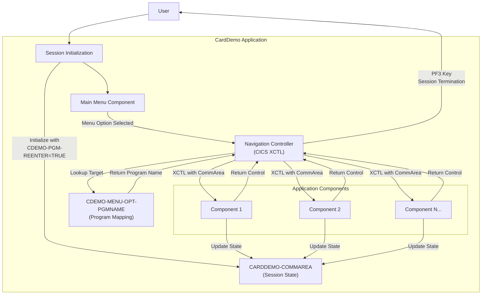

# Session Management for CardDemo Application

## User Story
_As a CardDemo application user, I want my session state to be maintained as I navigate through different components of the application, so that I can complete my tasks efficiently without losing context or having to re-enter information._

## Acceptance Criteria
1. GIVEN I am a new user WHEN I first access the application THEN my session should be properly initialized with the CDEMO-PGM-REENTER flag set to TRUE
2. GIVEN I am navigating the application WHEN I select a valid menu option THEN the system should transfer control to the appropriate program while maintaining my session context
3. GIVEN I am using the application WHEN I move between different screens THEN my user information and navigation history should be preserved in the CARDDEMO-COMMAREA structure
4. GIVEN I want to exit the application WHEN I press the PF3 key THEN the system should terminate my session and return me to the sign-on screen (COSGN00C)
5. System should use CICS XCTL commands to transfer program control while passing the commarea to maintain state
6. System should reference the CDEMO-MENU-OPT-PGMNAME array to determine the target program when a menu option is selected

## Test Scenarios
1. Verify that a new user session is correctly initialized with proper flags and default values in the CARDDEMO-COMMAREA
2. Confirm that selecting each valid menu option transfers control to the correct target program as defined in the CDEMO-MENU-OPT-PGMNAME array
3. Validate that user context information is preserved when navigating between different screens of the application
4. Verify that pressing PF3 properly terminates the session and returns the user to the sign-on screen
5. Test session behavior when invalid menu options are selected
6. Confirm that all required copybooks (COCOM01Y, COMEN02Y, COTTL01Y, etc.) are properly included and their data structures are correctly utilized
7. Validate that the session state is maintained even after multiple program transfers

## Diagram

## Subtasks
### Session Management
Manages user session state and navigation flow between different components of the CardDemo application. The component maintains session context through the CARDDEMO-COMMAREA structure, which preserves user information and navigation history. It handles program control transfers using CICS XCTL commands, passing the commarea to maintain state. When users select valid menu options, the component transfers control to the target program specified in CDEMO-MENU-OPT-PGMNAME array. The component implements session initialization logic by setting CDEMO-PGM-REENTER flag to TRUE on first entry. It also provides session termination functionality through the PF3 key, which returns users to the sign-on screen (COSGN00C). Dependencies include various copybooks (COCOM01Y, COMEN02Y, COTTL01Y, etc.) that define shared data structures and constants used across the application.
#### References
- [COMEN01C](/COMEN01C.md)