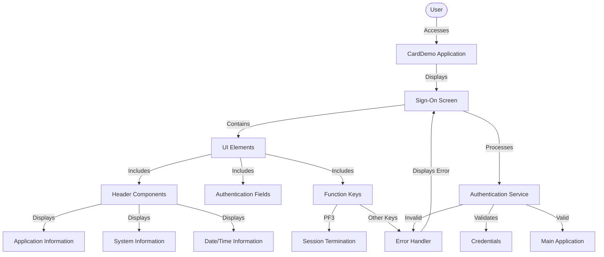

# Sign-on Screen Display and Navigation

## User Story
_As a CardDemo application user, I want a clear and functional sign-on screen, so that I can securely authenticate and access the application._

## Acceptance Criteria
1. GIVEN a user accesses the CardDemo application for the first time WHEN the application loads THEN the sign-on screen should be displayed with user ID and password fields
2. GIVEN the sign-on screen is displayed WHEN viewing the header THEN it should show application title, current date (MM/DD/YY), current time (HH:MM:SS), transaction ID, program name, application ID, and system ID
3. GIVEN a user is on the sign-on screen WHEN they press PF3 THEN a thank you message should be displayed and the session should end
4. GIVEN a user is on the sign-on screen WHEN they press any function key other than PF3 THEN an 'Invalid key' error message should be displayed
5. GIVEN a user attempts to log in WHEN validation errors occur THEN the sign-on screen should be redisplayed with appropriate error messages

## Test Scenarios
1. Verify that the sign-on screen displays correctly when a user first accesses the application (EIBCALEN = 0)
2. Confirm that all header information (application title, date, time, transaction ID, program name, application ID, system ID) is correctly displayed and formatted
3. Validate that the current date is correctly formatted as MM/DD/YY and the current time as HH:MM:SS
4. Verify that pressing PF3 displays the thank you message and exits the application
5. Confirm that pressing any function key other than PF3 displays an 'Invalid key' error message
6. Verify that the sign-on screen is redisplayed when validation errors occur during login attempts
7. Test the sign-on screen display across different screen resolutions and terminal types

## Diagram

## Subtasks
### Sign-on Screen Display
Manages the presentation of the sign-on screen interface for the CardDemo application. The component displays a login form with fields for user ID and password, along with header information including application title, current date and time, transaction ID, program name, application ID, and system ID. The screen is displayed either when a user first accesses the application (EIBCALEN = 0) or when validation errors occur during login attempts. The component handles function keys, specifically recognizing PF3 as an exit key that displays a thank you message, while other function keys trigger an 'Invalid key' error message. The component populates header information dynamically, formatting the current date as MM/DD/YY and time as HH:MM:SS using the system date and time.
#### References
- [COSGN00C](/COSGN00C.md)