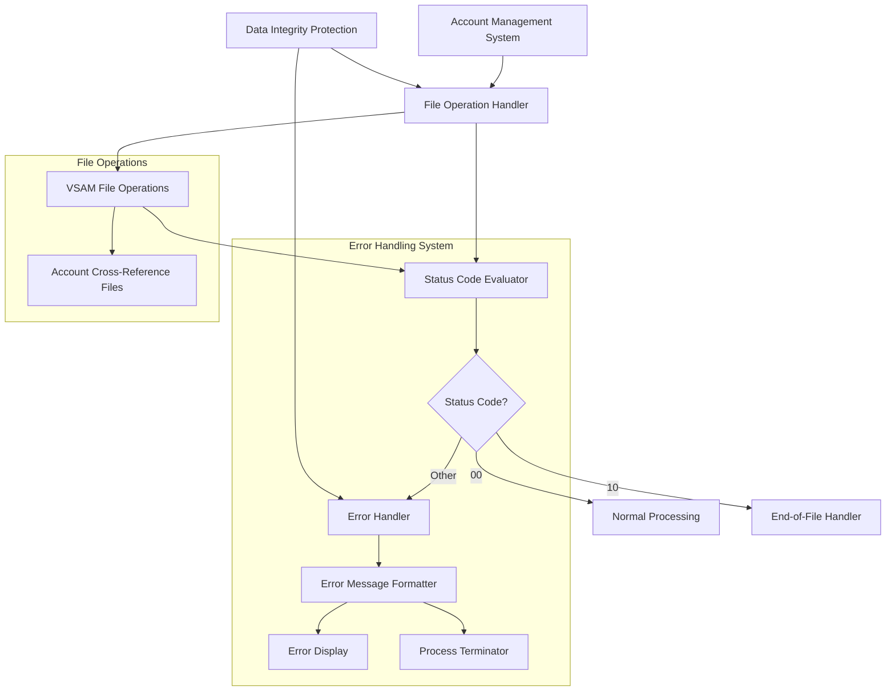

# Standardized File Operation Error Handling for Account Data Access

## User Story
_As an account management system operator, I want standardized error handling and reporting for account cross-reference file operations, so that I can quickly identify and resolve data access issues without compromising data integrity._

## Acceptance Criteria
1. GIVEN a file operation is performed WHEN the operation completes THEN the system should capture and evaluate the file status code
2. GIVEN a successful file operation WHEN the status code is '00' THEN the system should continue normal processing
3. GIVEN a file read operation WHEN the status code is '10' THEN the system should trigger appropriate end-of-file handling
4. GIVEN a file operation error WHEN the status code is neither '00' nor '10' THEN the system should display a formatted error message and terminate processing
5. GIVEN a numeric file status code WHEN displaying an error message THEN the system should format it as 'FILE STATUS IS: NNNN00xx' where xx is the status code
6. GIVEN a non-numeric status code or one beginning with '9' WHEN displaying an error message THEN the system should perform binary conversion of the second byte and display it as 'FILE STATUS IS: NNNNxyyy'
7. System should handle all VSAM file operations including open, read, and close operations for account cross-reference data
8. Feature must prevent further processing when data access is compromised to maintain data integrity

## Test Scenarios
1. Verify that normal processing continues when a file operation returns status code '00'
2. Verify that end-of-file handling is triggered when a read operation returns status code '10'
3. Verify that the program terminates with abend code 999 when an unrecoverable error occurs
4. Confirm error messages are correctly formatted as 'FILE STATUS IS: NNNN00xx' for standard numeric status codes
5. Confirm error messages are correctly formatted as 'FILE STATUS IS: NNNNxyyy' for non-numeric status codes or those beginning with '9'
6. Validate that binary conversion of the second byte is performed correctly for extended status codes
7. Verify that all file operations (open, read, close) are properly monitored for errors
8. Validate that the system prevents processing with compromised data access to maintain data integrity

## Diagram

## Subtasks
### Account Cross-Reference Data Validation
This subtask handles the validation and error processing for account cross-reference data access. It implements sophisticated error handling for VSAM file operations (open, read, close) with detailed status code reporting. The program converts both numeric and non-numeric file status codes into a standardized format for display. For numeric status codes, it displays them in the format 'FILE STATUS IS: NNNN00xx' where xx is the status code. For non-numeric status codes or those beginning with '9', it performs binary conversion of the second byte to display extended information in the format 'FILE STATUS IS: NNNNxyyy' where x is the first status byte and yyy is the converted value of the second byte. This provides operators with detailed diagnostic information about file access issues. The subtask uses a status code-based approach to determine program flow: status '00' continues normal processing, status '10' triggers end-of-file handling, and any other status triggers the error reporting and program termination sequence. This robust error handling ensures data integrity by preventing processing with compromised data access.
#### References
- [CBACT03C](/CBACT03C.md)
### File Operation Error Handling
This subtask provides comprehensive error handling for VSAM file operations including opening, reading, and closing the account file. It translates file status codes into user-readable messages and handles program termination when errors occur. The component uses a sophisticated error handling mechanism that: (1) Captures the file status code after each operation, (2) Determines if the operation was successful (status '00'), reached end-of-file (status '10'), or encountered an error, (3) For error conditions, displays descriptive messages and the specific file status code in a formatted manner (e.g., 'FILE STATUS IS: NNNN0037'), (4) Handles both numeric and non-numeric status codes with special processing for status codes beginning with '9', (5) Terminates the program with abend code 999 when unrecoverable errors occur. This ensures operational issues are clearly identified and reported.
#### References
- [CBACT01C](/CBACT01C.md)