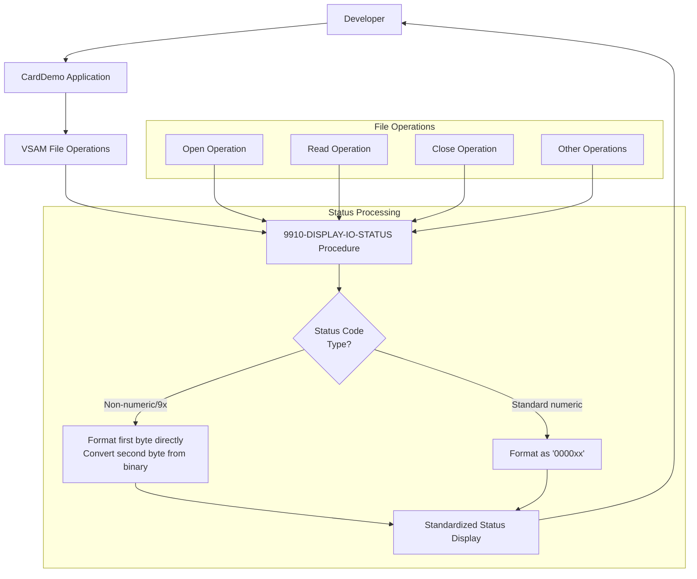

# Standardized File Status Reporting for VSAM Operations

## User Story
_As a developer working with the CardDemo application, I want standardized and consistent file status reporting for all VSAM file operations, so that I can quickly identify and troubleshoot file access issues during development and maintenance._

## Acceptance Criteria
1. GIVEN a VSAM file operation completes WHEN the operation returns any status code THEN the system should display the status in a standardized format
2. GIVEN a non-numeric status code or one beginning with '9' WHEN the status is reported THEN the system should format the first byte directly and convert the second byte from binary to display format
3. GIVEN a standard numeric code WHEN the status is reported THEN the system should format it as '0000xx' where xx is the status code
4. System should provide consistent error reporting across all file operations (open, read, close)
5. Feature must be implemented in the 9910-DISPLAY-IO-STATUS procedure and called whenever a file operation returns a non-successful status code

## Test Scenarios
1. Verify that a successful file operation with status '00' is displayed as 'FILE STATUS IS: NNNN0000'
2. Verify that an end-of-file condition with status '10' is displayed as 'FILE STATUS IS: NNNN0010'
3. Confirm the reporting mechanism handles non-numeric status codes by correctly formatting the first byte and converting the second byte
4. Validate that status reporting works consistently across different file operations (open, read, write, close)
5. Verify that the reporting mechanism is triggered for all non-successful file operations
6. Confirm the reporting format remains consistent across different error conditions and file types

## Diagram

## Subtasks
### File Status Reporting
This subtask provides detailed file operation status reporting for the VSAM file operations. It translates numeric and non-numeric file status codes into a standardized format for display. The component implements specialized handling for different types of file status codes: 1) For non-numeric status codes or those beginning with '9', it formats the first byte directly and converts the second byte from binary to display format, 2) For standard numeric codes, it formats them as '0000xx' where xx is the status code. For example, a file status of '00' would be displayed as 'FILE STATUS IS: NNNN0000', while a file status of '10' (end-of-file) would be displayed as 'FILE STATUS IS: NNNN0010'. This provides consistent error reporting across all file operations (open, read, close) and helps with debugging file access issues. The subtask is implemented in the 9910-DISPLAY-IO-STATUS procedure and is called whenever a file operation returns a non-successful status code.
#### References
- [CBACT02C](/CBACT02C.md)