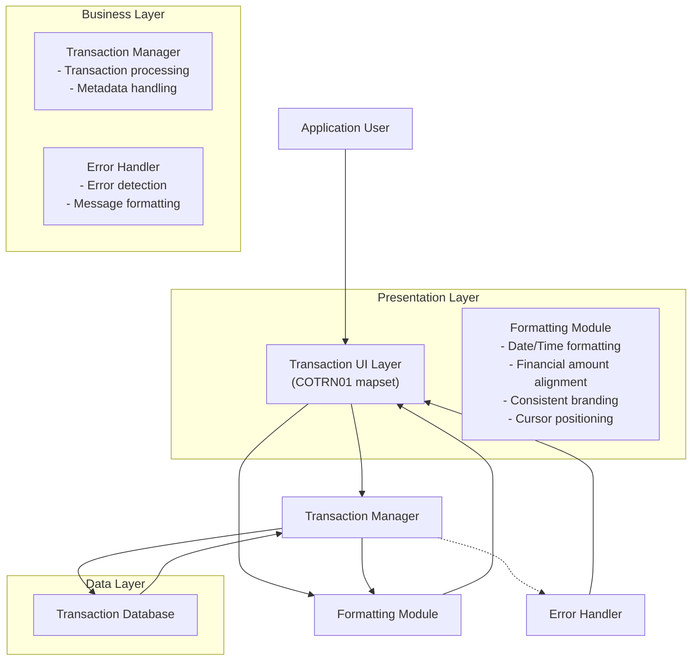

# Transaction Data Presentation Interface

## User Story
_As a CardDemo application user, I want transaction data to be presented in a clear, well-formatted interface, so that I can easily view, understand, and work with transaction details._

## Acceptance Criteria
1. GIVEN I am viewing a transaction WHEN the screen loads THEN the current date appears in MM/DD/YY format and time in HH:MM:SS format in the screen header
2. GIVEN I am viewing transaction details WHEN financial amounts are displayed THEN they should have proper decimal alignment and sign indicators
3. GIVEN I am viewing a transaction WHEN the screen is rendered THEN transaction metadata (processing timestamps, merchant details, and categorization) should be clearly visible
4. GIVEN an error occurs during transaction processing WHEN the error is detected THEN error messages should be prominently displayed at the bottom of the screen
5. GIVEN I navigate to a transaction screen WHEN the screen loads THEN the cursor should be positioned intelligently based on context (at transaction ID input field or error fields)
6. GIVEN I am using any screen in the application WHEN screens are displayed THEN they should maintain consistent CardDemo application branding with standard title information
7. GIVEN I am viewing transaction data WHEN the screen renders THEN the layout should follow mainframe user interface conventions using the COTRN01 mapset

## Test Scenarios
1. Verify that the date and time are correctly formatted in the screen header when viewing transactions at different times of day
2. Confirm transaction amounts display with proper decimal alignment for various values (positive, negative, zero, large amounts)
3. Verify that all transaction metadata (timestamps, merchant details, categorization) is displayed correctly for different transaction types
4. Validate that error messages appear at the bottom of the screen when various error conditions occur
5. Confirm the cursor is positioned at the transaction ID field when the screen initially loads
6. Verify the cursor automatically moves to error fields when validation errors occur
7. Validate that all screens maintain consistent CardDemo branding elements across different transaction scenarios
8. Verify the screen layout properly utilizes the COTRN01 mapset and required copybooks (COTTL01Y, CSDAT01Y, CSMSG01Y) for formatting

## Diagram

## Subtasks
### Transaction Data Presentation
This subtask handles the formatting and presentation of transaction data in a user-friendly interface. It populates the transaction detail screen with properly formatted data fields and maintains consistent header information. Business rules include: 1) The system formats the current date in MM/DD/YY format and time in HH:MM:SS format in the screen header; 2) Transaction amounts are displayed with appropriate decimal alignment and sign indicators; 3) The screen displays transaction metadata including processing timestamps, merchant details, and transaction categorization; 4) Error messages are prominently displayed at the bottom of the screen; 5) The cursor is positioned intelligently based on the context (typically at the transaction ID input field or at error fields); 6) The screen maintains consistent CardDemo application branding with standard title information. This component ensures that transaction data is presented in a clear, readable format that follows mainframe user interface conventions. It depends on the COTRN01 mapset for screen layout definition and various copybooks (COTTL01Y, CSDAT01Y, CSMSG01Y) for standard formatting elements.
#### References
- [COTRN01C](/COTRN01C.md)