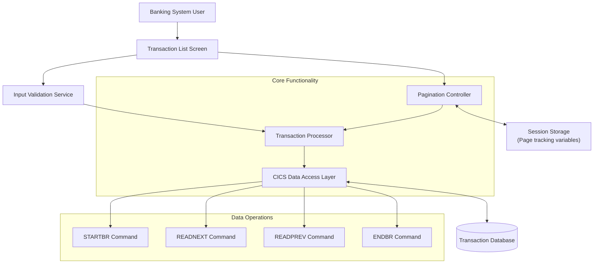

# Transaction List Navigation and Display

## User Story
_As a banking system user, I want to view and navigate through a paginated list of transactions, so that I can efficiently monitor and review customer transaction history._

## Acceptance Criteria
1. GIVEN I am on the transaction list screen WHEN the screen loads THEN I should see 10 transactions per page with transaction ID, date, description, and amount
2. GIVEN I am viewing a transaction list WHEN I press PF7 THEN the system should display the previous page of transactions
3. GIVEN I am viewing a transaction list WHEN I press PF8 THEN the system should display the next page of transactions
4. GIVEN I am on the first page of transactions WHEN I press PF7 THEN the system should display an appropriate message 'You are at the top of the page...'
5. GIVEN I am on the last page of transactions WHEN I press PF8 THEN the system should display an appropriate message 'You have reached the bottom of the page...'
6. GIVEN I am on the transaction list screen WHEN I enter a valid transaction ID in the input field THEN the system should position the list starting from that transaction ID
7. GIVEN I am on the transaction list screen WHEN I enter a non-numeric value in the transaction ID field THEN the system should display an error message indicating that the ID must be numeric
8. System should maintain the current page number in CDEMO-CT00-PAGE-NUM for pagination tracking
9. System should track first and last transaction IDs displayed on the current page in CDEMO-CT00-TRNID-FIRST and CDEMO-CT00-TRNID-LAST variables
10. Feature must use STARTBR, READNEXT, READPREV, and ENDBR CICS commands for efficient file navigation

## Test Scenarios
1. Verify that exactly 10 transactions are displayed per page when sufficient records exist
2. Verify that fewer than 10 transactions are displayed on the last page when the total number of transactions is not divisible by 10
3. Confirm pagination works correctly when pressing PF8 to move forward through multiple pages
4. Confirm pagination works correctly when pressing PF7 to move backward through multiple pages
5. Validate appropriate error message is displayed when attempting to navigate before the first page
6. Validate appropriate error message is displayed when attempting to navigate beyond the last page
7. Verify that entering a valid transaction ID positions the list starting with that transaction
8. Verify that entering a transaction ID that doesn't exist positions the list at the closest matching ID
9. Confirm error handling works correctly when non-numeric input is entered in the transaction ID field
10. Validate that the system correctly maintains first and last transaction IDs for the current page
11. Verify performance is acceptable when navigating through a large transaction dataset

## Diagram

## Subtasks
### Transaction List Display
This subtask manages the display of a paginated list of transactions from the TRANSACT file. It shows 10 transactions per page with transaction ID, date, description, and amount. The subtask handles pagination through PF7 (page up) and PF8 (page down) keys, maintaining the current page number in CDEMO-CT00-PAGE-NUM. When a user enters a specific transaction ID in the input field, the system positions the list starting from that ID. The subtask maintains first and last transaction IDs displayed on the current page (CDEMO-CT00-TRNID-FIRST and CDEMO-CT00-TRNID-LAST) to support pagination. Error handling includes validation of transaction ID input (must be numeric) and appropriate messages for navigation limits (e.g., 'You are at the top of the page...' or 'You have reached the bottom of the page...'). The component depends on the TRANSACT file for data access and uses STARTBR, READNEXT, READPREV, and ENDBR CICS commands for file navigation.
#### References
- [COTRN00C](/COTRN00C.md)