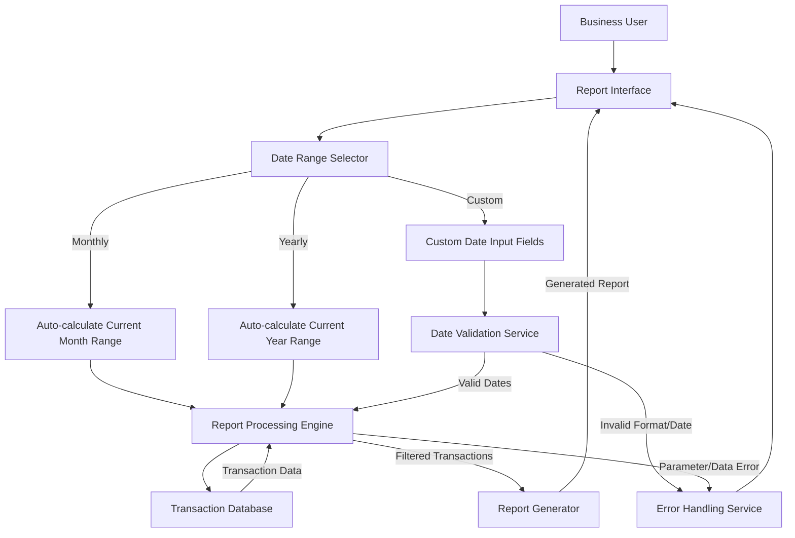

# Transaction Report Date Range Configuration

## User Story
_As a business user, I want to generate transaction reports for specific date ranges (monthly, yearly, or custom), so that I can analyze transaction data for relevant time periods without requesting IT assistance._

## Acceptance Criteria
1. GIVEN I select a monthly report WHEN I submit the report request THEN the system automatically sets the date range to the current month's first day to last day
2. GIVEN I select a yearly report WHEN I submit the report request THEN the system automatically sets the date range to January 1 to December 31 of the current year
3. GIVEN I select a custom report WHEN I enter start and end dates in YYYY-MM-DD format AND submit the report request THEN the system validates the dates and processes the report
4. GIVEN I enter an invalid date format WHEN I submit the report request THEN the system displays an error message and positions the cursor at the field in error
5. GIVEN I enter an invalid date (e.g., February 31) WHEN I submit the report request THEN the system displays 'Not a valid date...' error
6. GIVEN I leave a date field empty WHEN I submit the report request THEN the system enforces mandatory field validation and displays an appropriate error message
7. GIVEN valid date parameters are provided WHEN the report is generated THEN only transactions with processing timestamps within the specified date range are included in the report
8. GIVEN the parameter file cannot be read or contains invalid data WHEN the report is requested THEN the program terminates with an appropriate error message

## Test Scenarios
1. Verify that selecting a monthly report automatically sets the date range to the current month without requiring user input
2. Verify that selecting a yearly report automatically sets the date range to the current year without requiring user input
3. Verify that custom date ranges require both start and end dates in YYYY-MM-DD format
4. Confirm date validation rejects invalid formats (non-YYYY-MM-DD patterns)
5. Confirm date validation rejects invalid dates (e.g., February 30, month > 12, day > 31)
6. Validate that error messages are displayed with cursor positioning to the field in error
7. Verify that transactions outside the specified date range are excluded from the report
8. Verify that transactions within the specified date range are included in the report
9. Confirm the system handles edge cases like leap years correctly
10. Validate that the report fails gracefully with appropriate error messages when the parameter file is missing or corrupted

## Diagram

## Subtasks
### Report Parameter Management
This subtask handles the collection and validation of report parameters from users. For monthly reports, the system automatically calculates the date range (current month's first day to last day). For yearly reports, it sets January 1 to December 31 of the current year. For custom reports, it collects and validates start and end dates entered by the user. The date validation includes: (1) Format checking to ensure dates follow YYYY-MM-DD pattern, (2) Range validation to ensure months are 1-12 and days are 1-31, (3) Date validity checking using CSUTLDTC utility to verify dates like February 30 are rejected. For example, if February 31 is entered, the system will display 'Not a valid date...' error. The component enforces mandatory field validation - all date components (month, day, year) must be provided for both start and end dates. The system also converts user input from character to numeric format for validation using FUNCTION NUMVAL-C. Error handling includes field-specific error messages with cursor positioning to the field in error. This subtask depends on the CSUTLDTC utility for comprehensive date validation.
#### References
- [CORPT00C](/CORPT00C.md)
### Date Range Filtering
This subtask handles the filtering of transaction records based on a specified date range. The program reads start and end dates from a parameter file and uses these values to filter transactions for inclusion in the report. Only transactions with processing timestamps (TRAN-PROC-TS) falling within the specified date range are included. The date comparison uses a simple string comparison on the first 10 characters of the timestamp (YYYY-MM-DD format). For example, if the parameter file specifies a date range of '2023-01-01' to '2023-01-31', only transactions with processing dates in January 2023 will be included in the report. The business rule requires that both start and end dates must be provided in the parameter file in the correct format. If the parameter file cannot be read or contains invalid data, the program terminates with an error message. This filtering mechanism allows users to generate reports for specific time periods without modifying the program code. The subtask depends on the date parameter file (DATEPARM) and the transaction file's timestamp field.
#### References
- [CBTRN03C](/CBTRN03C.md)