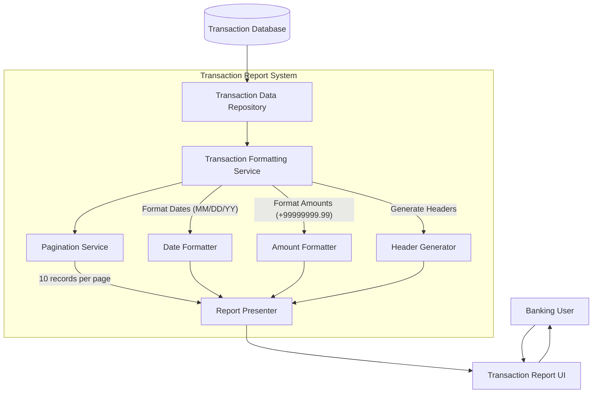

# Transaction Report Formatting and Display

## User Story
_As a banking application user, I want transaction data to be formatted in a user-friendly way when viewing transaction reports, so that I can easily read and understand the transaction information._

## Acceptance Criteria
1. GIVEN I am viewing a transaction report WHEN the report loads THEN transaction dates should be displayed in MM/DD/YY format
2. GIVEN I am viewing a transaction report WHEN the report loads THEN transaction amounts should be displayed as signed numeric fields with two decimal places (+99999999.99)
3. GIVEN I am viewing a transaction report WHEN the report loads THEN the header should display current date and time, application title, transaction name, and program name
4. GIVEN I am viewing a transaction report WHEN there are multiple transactions THEN up to 10 transaction records should be displayed per page
5. GIVEN I am viewing a transaction report WHEN transaction data is loaded THEN all transaction fields (ID, date, amount, etc.) should be properly populated and aligned

## Test Scenarios
1. Verify that transaction dates are correctly converted from internal format '20220719' to display format '07/19/22'
2. Verify that transaction amounts are correctly formatted with sign and two decimal places (e.g., +00000123.45)
3. Confirm header information displays current system date/time, correct application title, transaction name, and program name
4. Validate that exactly 10 transactions are displayed per page when more than 10 transactions are available
5. Validate that fewer than 10 transactions are correctly displayed when less than 10 transactions are available
6. Verify that all transaction fields (TRNID01I through TRNID10I, TDATE01I through TDATE10I, etc.) are populated with the correct data

## Diagram

## Subtasks
### Transaction Data Formatting
This subtask handles the formatting and presentation of transaction data for display. It converts internal data formats to user-friendly display formats, particularly for dates and amounts. For transaction dates, it extracts the date portion from TRAN-ORIG-TS timestamp and reformats it as MM/DD/YY in WS-TRAN-DATE (e.g., converting '20220719' to '07/19/22'). For transaction amounts, it formats TRAN-AMT as a signed numeric field with two decimal places (format +99999999.99) for display. The subtask also populates header information including current date and time, application title, transaction name, and program name. It handles the population of up to 10 transaction records per page into the appropriate screen fields (TRNID01I through TRNID10I, TDATE01I through TDATE10I, etc.). This ensures consistent and user-friendly presentation of transaction data across the application.
#### References
- [COTRN00C](/COTRN00C.md)