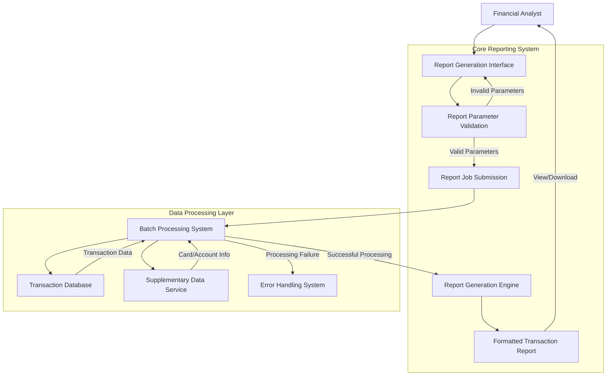

# Transaction Report Generation and Management

## User Story
_As a financial analyst, I want to generate detailed transaction reports with flexible date range options, so that I can analyze card transaction patterns and provide accurate financial summaries to stakeholders._

## Acceptance Criteria
1. GIVEN I am on the report generation interface WHEN I select a report type (monthly, yearly, or custom) THEN the system should pre-populate appropriate date ranges based on my selection
2. GIVEN I have selected a custom date range WHEN I enter dates in an incorrect format or invalid dates THEN the system should display specific validation errors and position the cursor at the error field
3. GIVEN I have entered valid report parameters WHEN I confirm the report submission THEN the system should construct and submit the appropriate JCL job to generate the report
4. GIVEN a report job has been submitted WHEN the batch process executes THEN transactions should be filtered by the specified date range and include all required supplementary information
5. GIVEN transaction data exists for the specified period WHEN the report is generated THEN it should display transaction details organized by card number with proper formatting and pagination
6. GIVEN multiple transactions exist for a card WHEN the report is generated THEN it should calculate and display page totals, account totals, and grand totals accurately
7. GIVEN a lookup for supplementary information fails WHEN processing a transaction THEN the system should terminate with a clear error message identifying the specific lookup failure
8. GIVEN a report has been generated WHEN viewing the first page THEN it must display the date range parameters being reported

## Test Scenarios
1. Verify that monthly report selection automatically sets the date range from the first to the last day of the current month
2. Verify that yearly report selection automatically sets the date range from January 1 to December 31 of the current year
3. Confirm validation correctly identifies and reports format errors when entering dates (e.g., entering '13' for month displays 'Not a valid Month...' error)
4. Validate that the system requires explicit confirmation (Y/y) before submitting any report job
5. Verify that the JCL job is correctly constructed with appropriate date parameters based on the selected report type
6. Confirm that transactions outside the specified date range are excluded from the report
7. Verify that supplementary information (account ID, transaction type description, category description) is correctly retrieved and displayed for each transaction
8. Test that page breaks occur after 20 detail lines with appropriate page totals displayed
9. Validate that account totals are correctly calculated and displayed when changing to a new card number
10. Verify that grand totals at the end of the report accurately reflect the sum of all transactions in the report
11. Test error handling when a transaction references a non-existent transaction type or category
12. Confirm that the first page of the report includes the date range parameters being reported

## Diagram

## Subtasks
### Transaction Report Job Submission
This subtask allows users to generate transaction reports by submitting batch jobs from an online interface. The component provides three report types: monthly, yearly, and custom date range reports. Business rules include: (1) Monthly reports automatically use the current month as the date range (from first day of current month to last day), (2) Yearly reports use the entire current year (Jan 1 to Dec 31), (3) Custom reports require user-specified start and end dates. The component performs extensive date validation including: format validation (YYYY-MM-DD), range validation (months 1-12, days 1-31), and date validity checking using the CSUTLDTC utility. For example, if a user enters '13' for a month, the system will display 'Not a valid Month...' error. The component requires explicit user confirmation (Y/y) before submitting any report job. The job submission process uses an extra partition transient data queue (TDQ) named 'JOBS' to submit JCL to the internal reader. The JCL includes parameters for the date range that will be used by the batch job TRNRPT00 to filter transactions. Error handling includes comprehensive input validation with specific error messages for each validation failure and proper cursor positioning to the field in error. The component depends on the CSUTLDTC utility for date validation and the TRNRPT00 batch job for actual report generation.
#### References
- [CORPT00C](/CORPT00C.md)
### JCL Job Construction
This subtask dynamically constructs the JCL job that will be submitted to generate the transaction report. The JCL includes a job card, JOBLIB statement, procedure execution statement (PROC=TRANREPT), and parameter specifications. The component builds the JCL with the appropriate date parameters based on the report type selected and dates provided. For monthly reports, it calculates the first and last day of the current month. For yearly reports, it sets January 1 to December 31 of the current year. For custom reports, it uses the validated user-provided dates. The date parameters are inserted into the JCL in two places: in the SYMNAMES DD statement (for symbolic variable substitution) and in the DATEPARM DD statement (for direct parameter passing). The JCL references a stored procedure (TRANREPT) that contains the actual report generation logic. The component writes each line of the constructed JCL to the 'JOBS' transient data queue, which serves as an interface to the internal reader for job submission. Error handling includes checking the response codes from the WRITEQ TD command and displaying an error message if the submission fails. This subtask depends on the existence of the AWS.M2.CARDDEMO.PROC library containing the TRANREPT procedure.
#### References
- [CORPT00C](/CORPT00C.md)
### Transaction Detail Report Generation
This subtask generates detailed transaction reports filtered by date range. The program reads transaction records from a sequential file and filters them based on start and end dates specified in a parameter file. For each transaction within the date range, it looks up additional information from three indexed files: a card cross-reference file to get account information, a transaction type file for transaction descriptions, and a transaction category file for category descriptions. The report is organized by card number and includes transaction details such as transaction ID, account ID, transaction type, category, source, and amount. The program calculates and displays running totals at three levels: page totals, account totals, and grand totals for transaction amounts. For example, if transactions of $100, $200, and $300 exist for a card, the account total would be $600. If this spans two pages with $300 on each, there would be page totals of $300 each. Business rules include: (1) Transactions are only included if their processing timestamp falls within the specified date range, (2) When a new card number is encountered, account totals for the previous card are printed, (3) Page totals are printed when a page is full (after 20 detail lines). Error handling includes validation of file operations with specific error codes displayed and program termination if critical errors occur. The program depends on five input files: transaction file, card cross-reference file, transaction type file, transaction category file, and date parameter file.
#### References
- [CBTRN03C](/CBTRN03C.md)
### Transaction Data Lookup
This subtask handles the lookup of supplementary transaction information from multiple indexed files to enrich the transaction report data. For each transaction record, the program performs three key lookups: (1) Card cross-reference lookup - uses the card number to retrieve the associated account ID, (2) Transaction type lookup - uses the transaction type code to retrieve the transaction type description, (3) Transaction category lookup - uses both transaction type code and category code to retrieve the category description. These lookups are performed using VSAM indexed files with random access mode. The business rule requires that all lookups must be successful - if any lookup fails (invalid key), the program displays an error message with the specific key that failed and terminates execution. For example, if transaction type 'PU' is not found in the transaction type file, the program would display 'INVALID TRANSACTION TYPE: PU' and terminate. This ensures data integrity in the report by preventing incomplete or incorrect information from being displayed. The subtask depends on three indexed files: CARDXREF (card cross-reference file), TRANTYPE (transaction type file), and TRANCATG (transaction category file).
#### References
- [CBTRN03C](/CBTRN03C.md)
### Transaction Report Formatting
This subtask handles the formatting and layout of the transaction detail report, ensuring proper organization and presentation of transaction data. The report includes headers, detail lines, and summary sections with totals. The program manages page breaks after every 20 detail lines (configurable via WS-PAGE-SIZE variable), printing appropriate headers and page totals. The report structure includes: (1) Report name header with date range parameters, (2) Column headers for transaction details, (3) Detail lines with transaction information, (4) Page totals at page breaks, (5) Account totals when changing to a new card number, and (6) Grand totals at the end of the report. For example, if a customer has transactions totaling $1,500 across multiple pages, the report would show individual transaction details, page subtotals at each page break, an account total of $1,500 when moving to the next customer, and a grand total of all transactions at the end. The business rule requires that the first page of the report must include the date range being reported (from the parameter file). The subtask handles the special case of the first page (WS-FIRST-TIME = 'Y') by printing initial headers. Error handling includes validation of write operations to the report file with program termination if errors occur.
#### References
- [CBTRN03C](/CBTRN03C.md)