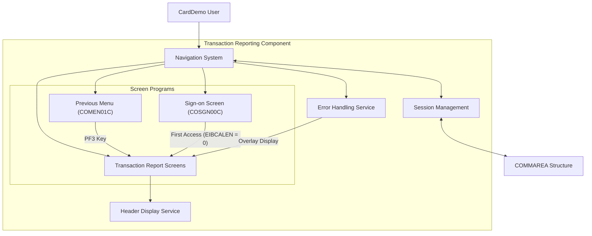

# Transaction Reporting Navigation System

## User Story
_As a CardDemo application user, I want a consistent and intuitive navigation system within the transaction reporting component, so that I can efficiently move between screens while maintaining my session context._

## Acceptance Criteria
1. GIVEN I am using the transaction reporting component WHEN I press PF3 THEN the system returns me to the previous menu (COMEN01C program)
2. GIVEN I access the transaction reporting component for the first time (EIBCALEN = 0) WHEN the component initializes THEN I am redirected to the sign-on screen (COSGN00C)
3. GIVEN I am on any screen within the transaction reporting component WHEN the screen renders THEN header information (application title, transaction ID, program name, current date, and time) is displayed
4. GIVEN I am navigating between screens WHEN I move from one screen to another THEN my session state is preserved through the COMMAREA structure
5. GIVEN I press an invalid function key WHEN the system processes my input THEN an appropriate error message is displayed without full screen erasure
6. GIVEN I am viewing an error message WHEN I take corrective action THEN the system uses overlay display technique rather than full screen erase

## Test Scenarios
1. Verify that pressing PF3 from any transaction reporting screen returns the user to the COMEN01C program
2. Confirm that a new session (EIBCALEN = 0) redirects to the sign-on screen (COSGN00C)
3. Validate that all screens display the correct header information including application title, transaction ID, program name, current date, and time
4. Verify that session context is maintained when navigating between different screens within the component
5. Confirm that pressing an undefined function key displays an appropriate error message
6. Validate that the CARDDEMO-COMMAREA structure correctly tracks calling and target programs during navigation
7. Verify that error messages are displayed using overlay technique rather than full screen erase
8. Confirm that initial screen displays use full screen erase for proper rendering

## Diagram

## Subtasks
### User Interface Navigation
This subtask manages the user interface flow and navigation within the transaction reporting component. It handles PF key processing, specifically recognizing PF3 as a return to previous menu (COMEN01C program). The component maintains session state through the COMMAREA, preserving context between interactions. When first accessed (EIBCALEN = 0), it redirects to the sign-on screen (COSGN00C). The component implements a screen rendering process that populates header information (application title, transaction ID, program name, current date, and time) on each display. It manages screen erasure based on context - using full screen erase for initial displays and overlay for error messages. The component handles invalid key presses by displaying appropriate error messages. Navigation state is maintained in the CARDDEMO-COMMAREA structure, which tracks the calling and target programs. This subtask depends on the CICS command level interface for screen management and program control operations.
#### References
- [CORPT00C](/CORPT00C.md)