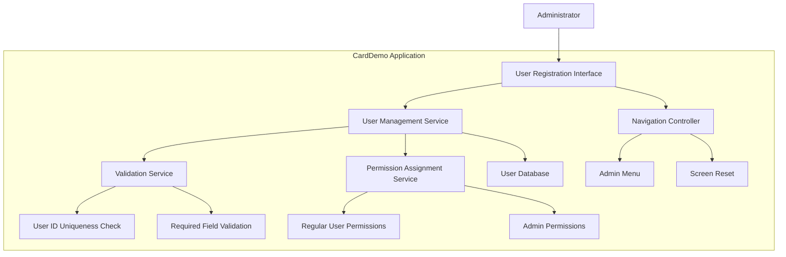

# User Registration System

## User Story
_As an administrator, I want to create and manage user accounts in the CardDemo application, so that authorized users can access the system with appropriate permissions._

## Acceptance Criteria
1. GIVEN I am on the user registration screen WHEN I enter all required user details (first name, last name, user ID, password, and user type) THEN a new user account is successfully created
2. GIVEN I am on the user registration screen WHEN I attempt to create a user with an existing user ID THEN the system displays an error message 'User ID already exist...'
3. GIVEN I am on the user registration screen WHEN I submit the form with any empty mandatory field THEN the system displays a specific validation message for that field
4. GIVEN I am on the user registration screen WHEN I specify a user type THEN the system correctly assigns either regular or admin permissions
5. GIVEN I am on the user registration screen WHEN I press PF3 THEN I am returned to the admin menu
6. GIVEN I am on the user registration screen WHEN I press PF4 THEN the current screen is cleared

## Test Scenarios
1. Verify that a new user account is successfully created when all mandatory fields are completed correctly
2. Verify that the system prevents creation of accounts with duplicate user IDs
3. Confirm each mandatory field (first name, last name, user ID, password, user type) triggers appropriate validation messages when left empty
4. Validate that both regular and admin user types can be created with appropriate permissions
5. Verify that user data is correctly stored in the USRSEC file after successful registration
6. Confirm navigation functions work correctly: PF3 returns to admin menu and PF4 clears the screen
7. Verify that the system handles special characters in name fields appropriately
8. Test boundary conditions for field lengths (minimum/maximum characters)

## Diagram

## Subtasks
### User Registration
This subtask manages the creation of new user accounts in the CardDemo application security system. It captures and validates user details through a form interface and stores them in the USRSEC file. Business rules include: (1) All fields are mandatory - first name, last name, user ID, password, and user type must be provided; (2) User IDs must be unique in the system; (3) The system supports two types of users: regular users and admin users, specified in the user type field. The process validates all input fields before attempting to write to the database. Error handling includes specific validation messages for each empty field (e.g., 'First Name can NOT be empty...') and handling duplicate user ID errors with appropriate feedback ('User ID already exist...'). The component depends on the USRSEC file for storing user credentials and security information. Navigation options include returning to the admin menu (PF3) or clearing the current screen (PF4).
#### References
- [COUSR01C](/COUSR01C.md)