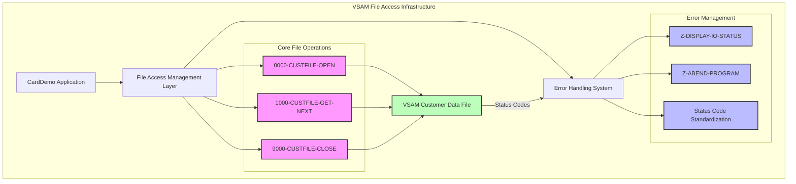

# VSAM Customer Data Access Infrastructure

## User Story
_As a CardDemo application developer, I want a reliable VSAM file access management infrastructure, so that I can safely and consistently access customer data with proper error handling and reporting._

## Acceptance Criteria
1. GIVEN a VSAM customer data file WHEN the 0000-CUSTFILE-OPEN routine is called THEN the file is opened with proper status validation
2. GIVEN an open VSAM customer file WHEN the 1000-CUSTFILE-GET-NEXT routine is called THEN the next customer record is retrieved with appropriate status handling
3. GIVEN an open VSAM customer file WHEN the 9000-CUSTFILE-CLOSE routine is called THEN the file is properly closed with status validation
4. GIVEN any file operation WHEN a non-zero status code occurs (except '10' for EOF) THEN the Z-DISPLAY-IO-STATUS routine formats and displays the error in a human-readable format
5. GIVEN a critical file error WHEN the Z-ABEND-PROGRAM routine is triggered THEN the program terminates with abend code 999 and displays an appropriate error message
6. System should standardize file status checking where '00' indicates success, '10' indicates EOF, and other codes trigger error handling
7. Feature must convert non-numeric status codes to a standardized format (NNNN followed by a 4-digit code) for consistent error reporting

## Test Scenarios
1. Verify that the CUSTFILE opens successfully when the file exists and has valid permissions
2. Verify that the CUSTFILE-GET-NEXT routine correctly retrieves sequential records until EOF is reached
3. Verify that the CUSTFILE-GET-NEXT routine correctly identifies and handles the EOF condition (status '10')
4. Verify that the CUSTFILE-CLOSE routine properly closes an open file
5. Confirm error handling correctly identifies and reports various error conditions (file not found, access denied, etc.)
6. Confirm Z-DISPLAY-IO-STATUS correctly formats both numeric and non-numeric status codes
7. Validate that the Z-ABEND-PROGRAM routine terminates execution with the correct abend code when critical errors occur
8. Verify that all file operations properly validate the file status before proceeding

## Diagram

## Subtasks
### VSAM File Access Management
This subtask manages the low-level VSAM file operations required to access customer data. It includes specialized routines for opening (0000-CUSTFILE-OPEN), reading (1000-CUSTFILE-GET-NEXT), and closing (9000-CUSTFILE-CLOSE) the indexed VSAM file. Each operation includes validation of the file status and appropriate error handling. The component implements a standardized approach to file status checking where: 1) Status '00' indicates successful operation, 2) Status '10' indicates end-of-file condition, 3) Any other status triggers error handling. When errors occur, the Z-DISPLAY-IO-STATUS routine formats and displays the file status in a human-readable format, converting non-numeric status codes to a standardized format (NNNN followed by a 4-digit code). The Z-ABEND-PROGRAM routine terminates the program with abend code 999 after displaying an error message. This infrastructure ensures reliable data access with proper error detection and reporting.
#### References
- [CBCUS01C](/CBCUS01C.md)