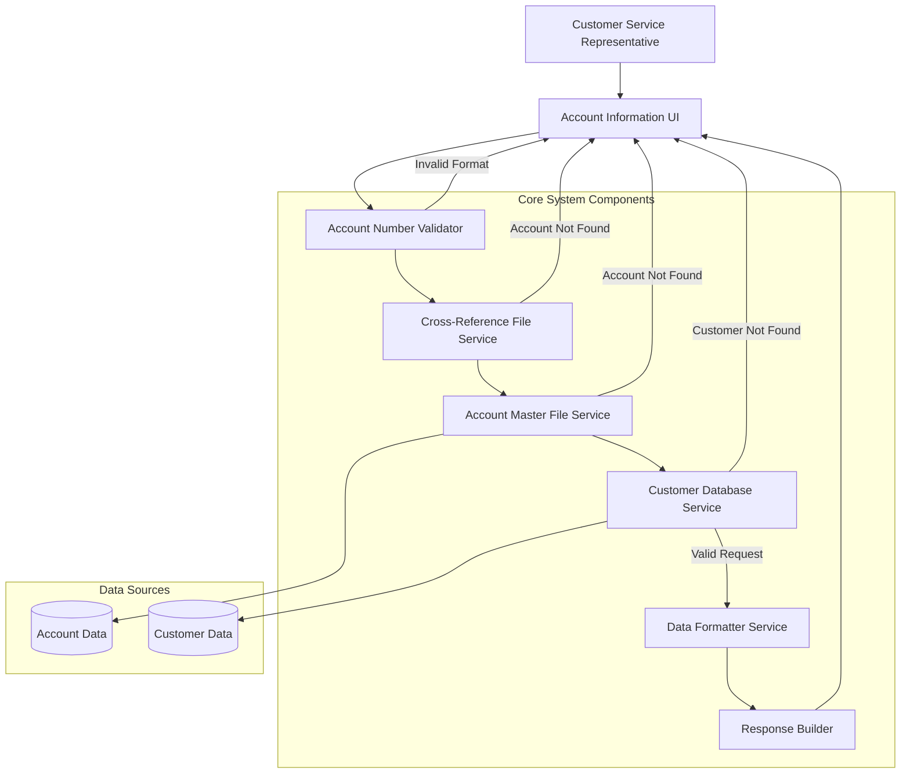

# View Account Information

## User Story
_As a bank customer service representative, I want to retrieve and view comprehensive account information by entering an account number, so that I can assist customers with inquiries and resolve issues efficiently._

## Acceptance Criteria
1. GIVEN I am on the account information screen WHEN I enter a valid 11-digit account number THEN the system should display complete account details including financial data and customer information
2. GIVEN I enter an invalid account number WHEN I submit the request THEN the system should display an appropriate error message explaining the validation failure
3. GIVEN I enter a valid account number WHEN the account exists in the cross-reference file but not in the master file THEN the system should display a specific error message indicating the account was not found in the master file
4. GIVEN I enter a valid account number WHEN the associated customer record cannot be found THEN the system should display an error message indicating the customer was not found
5. System should format displayed data appropriately (SSN as XXX-XX-XXXX, currency with proper symbols, dates in standard format)
6. System should provide clear navigation options for returning to previous screens or performing additional actions
7. Feature must validate that the account number is numeric, non-zero, and exactly 11 digits in length
8. Feature must check that the account exists in both the cross-reference file and account master file before attempting to display information
9. Feature must display comprehensive account information including status, balances, credit limits, cycle credits/debits, and all relevant dates
10. Feature must display complete customer information including personal details, address, and contact information

## Test Scenarios
1. Verify that complete account information is displayed when a valid account number is entered
2. Verify that appropriate error messages are displayed for each validation rule violation (empty input, non-numeric input, wrong length)
3. Confirm the system correctly handles the scenario when an account exists in the cross-reference file but not in the master file
4. Confirm the system correctly handles the scenario when an account exists but the associated customer record is not found
5. Validate that SSN is properly formatted from raw data (123456789) to display format (123-45-6789)
6. Validate that currency values are properly formatted with appropriate symbols and decimal places
7. Validate that all date fields are properly formatted according to system standards
8. Verify that all account details (status, balance, limits, dates) are correctly retrieved and displayed
9. Verify that all customer details (ID, name, address, contact info) are correctly retrieved and displayed
10. Confirm the system handles file access errors gracefully with appropriate error messages
11. Verify that screen attributes are properly set (protected/unprotected fields, cursor positioning, color coding)
12. Test navigation options to ensure users can easily return to previous screens or perform additional actions

## Diagram

## Subtasks
### Account Detail Retrieval
This subtask retrieves and displays comprehensive account information when a user enters an account number. The process involves:

1. Business Rules:
   - Users must enter a valid 11-digit numeric account number
   - The account must exist in the account cross-reference file and account master file
   - The system retrieves associated customer information to display a complete view

2. Validation Rules:
   - Account ID must be numeric and non-zero
   - Account ID must be 11 digits in length
   - Account must exist in the cross-reference file (CXACAIX)
   - Account must exist in the account master file (ACCTDAT)
   - Associated customer must exist in the customer master file (CUSTDAT)

3. Error Handling:
   - Empty account number: 'Account number not provided'
   - Non-numeric or zero account number: 'Account Filter must be a non-zero 11 digit number'
   - Account not found in cross-reference: 'Account: [number] not found in Cross ref file'
   - Account not found in master file: 'Account: [number] not found in Acct Master file'
   - Customer not found: 'CustId: [number] not found in customer master'
   - File access errors: Detailed error messages with response codes

4. Dependencies:
   - Requires access to three database files:
     * CXACAIX (Card-Account cross-reference file)
     * ACCTDAT (Account master file)
     * CUSTDAT (Customer master file)
   - Integrates with the CardDemo navigation framework
   - Uses common screen layout components

5. Data Transformation:
   - Social Security Number formatting: Transforms raw SSN (e.g., 123456789) into formatted display (e.g., 123-45-6789)
   - Currency formatting for financial fields (balance, credit limits)
   - Date formatting for account dates (open date, expiration date, reissue date)
#### References
- [COACTVWC](/COACTVWC.md)
### Account Information Display
This subtask manages the presentation of account information on the screen, including formatting data fields, setting screen attributes, and handling the display of messages.

1. Business Rules:
   - Display comprehensive account information including financial data and customer details
   - Format data fields appropriately for user readability
   - Highlight errors and important information
   - Provide clear navigation options

2. Display Components:
   - Account details: status, current balance, credit limits, cycle credits/debits
   - Account dates: open date, expiration date, reissue date
   - Customer information: ID, SSN, FICO score, DOB, name fields
   - Customer address: multiple address lines, city, state, zip, country
   - Customer contact: phone numbers, government ID, EFT account

3. Screen Attribute Management:
   - Sets input field attributes (protected/unprotected)
   - Positions cursor based on context (error fields or input fields)
   - Sets color attributes (red for errors, neutral for information)
   - Controls field highlighting based on validation results

4. Message Handling:
   - Displays error messages in designated area
   - Shows informational messages about current operation
   - Provides clear instructions for user actions

5. Dependencies:
   - Uses BMS map COACTVW for screen layout
   - Relies on common screen components (titles, date/time display)
   - Integrates with CardDemo navigation framework for PF key handling
#### References
- [COACTVWC](/COACTVWC.md)
### Account Cross-Reference Data Retrieval
This subtask retrieves and displays account cross-reference data from an indexed VSAM file (XREFFILE). The cross-reference data links credit card numbers with account information, providing a mapping mechanism between different identifiers in the system. The program sequentially reads records from the file and displays each record's content until the end of file is reached. Each record contains a 16-character card number (FD-XREF-CARD-NUM) and 34 characters of associated reference data (FD-XREF-DATA). The subtask implements comprehensive error handling for file operations with specific business rules: (1) File status '00' indicates successful operation, (2) File status '10' indicates end-of-file condition, (3) Any other status code triggers detailed error reporting and program termination. The program uses CEE3ABD with error code 999 to terminate in case of file access errors, ensuring data integrity by preventing partial processing. This component depends on the CVACT03Y copybook which likely contains the definition of the CARD-XREF-RECORD structure used for displaying the retrieved data.
#### References
- [CBACT03C](/CBACT03C.md)
### Account Data Retrieval
This subtask sequentially reads account records from the ACCTFILE (an indexed VSAM file) and displays detailed account information. The component processes each record in the file until it reaches the end, displaying key account details including account ID, active status, current balance, credit limits, and important dates. Business rules include: (1) Records are accessed sequentially rather than by specific key, (2) All account records in the file are processed without filtering, (3) The program handles file operation errors with specific status codes - '00' for successful operations, '10' for end-of-file condition, and other codes for various error conditions. If any file operation error occurs (except normal EOF), the program displays the error status and terminates with abend code 999. The component depends on the CVACT01Y copybook which contains the account record structure definition.
#### References
- [CBACT01C](/CBACT01C.md)
### Account Data Display Formatting
This subtask formats and displays account information in a human-readable format. For each account record retrieved, it displays labeled fields including ACCT-ID, ACCT-ACTIVE-STATUS, ACCT-CURR-BAL, ACCT-CREDIT-LIMIT, ACCT-CASH-CREDIT-LIMIT, ACCT-OPEN-DATE, ACCT-EXPIRAION-DATE, ACCT-REISSUE-DATE, ACCT-CURR-CYC-CREDIT, ACCT-CURR-CYC-DEBIT, and ACCT-GROUP-ID. Each field is clearly labeled with a descriptive prefix followed by the actual data value. A separator line of dashes is displayed between account records for improved readability. This subtask is executed for each successfully retrieved account record and depends on the successful execution of the Account Data Retrieval subtask.
#### References
- [CBACT01C](/CBACT01C.md)