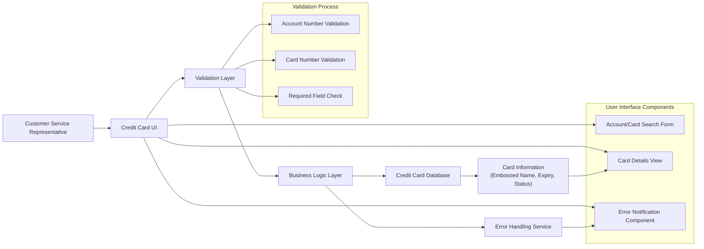

# View Credit Card Details

## User Story
_As a credit card customer service representative, I want to view detailed information for a specific credit card by entering account and card numbers, so that I can assist customers with inquiries about their credit cards._

## Acceptance Criteria
1. GIVEN I am on the credit card list screen WHEN I enter a valid 11-digit account number and 16-digit card number THEN the system displays the corresponding card details including embossed name, expiration date, and card status
2. GIVEN I am on the credit card detail screen WHEN I enter an invalid account number (non-numeric, zeros, or not 11 digits) THEN the system highlights the field in red and displays an appropriate error message
3. GIVEN I am on the credit card detail screen WHEN I enter an invalid card number (non-numeric, zeros, or not 16 digits) THEN the system highlights the field in red and displays an appropriate error message
4. GIVEN I am on the credit card detail screen WHEN I leave either the account number or card number blank THEN the system displays an error message indicating the missing field
5. GIVEN I am on the credit card detail screen WHEN I enter a valid account number but a card number that doesn't exist for that account THEN the system displays an error message indicating no matching card was found
6. GIVEN I am on the credit card detail screen WHEN there is a file access error THEN the system displays an appropriate error message

## Test Scenarios
1. Verify that correct card details are displayed when valid 11-digit account number and 16-digit card number are entered
2. Verify that an error message is displayed when a non-numeric account number is entered
3. Verify that an error message is displayed when a non-numeric card number is entered
4. Verify that an error message is displayed when an account number with fewer than 11 digits is entered
5. Verify that an error message is displayed when a card number with fewer than 16 digits is entered
6. Verify that an error message is displayed when an account number of all zeros is entered
7. Verify that an error message is displayed when a card number of all zeros is entered
8. Verify that an error message is displayed when the account number field is left blank
9. Verify that an error message is displayed when the card number field is left blank
10. Verify that an error message is displayed when a valid account number is entered with a card number that doesn't exist for that account
11. Confirm that spaces or asterisks in input fields are treated as blank/low-values and appropriate error messages are displayed
12. Validate that the system can handle file access errors and displays appropriate error messages

## Diagram

## Subtasks
### Credit Card Detail Retrieval
This subtask retrieves and displays detailed information for a specific credit card. It accepts account number and card number as inputs, validates them, and retrieves the corresponding card details from the card data file. The retrieved information includes the embossed name on the card, expiration date (month/year), and card status. Business rules include: (1) Account numbers must be 11-digit numeric values; non-numeric or zero values are rejected with appropriate error messages. (2) Card numbers must be 16-digit numeric values; non-numeric or zero values are rejected with appropriate error messages. (3) Both account number and card number are required; if either is missing, an error message is displayed. (4) The system validates that the card exists for the specified account; if not found, an error message is displayed. Error handling includes specific messages for invalid inputs (e.g., 'Account number must be a non zero 11 digit number'), record not found scenarios (e.g., 'Did not find cards for this search condition'), and file access errors. This subtask depends on the card data file (CARDDAT) and can be accessed from the credit card list screen (COCRDLIC).
#### References
- [COCRDSLC](/COCRDSLC.md)
### Credit Card Input Validation
This subtask validates user inputs for credit card detail retrieval. It performs field-level validations to ensure data integrity before attempting to retrieve card information. Validation rules include: (1) Account number validation: Must be an 11-digit numeric value; cannot be spaces, zeros, or non-numeric characters. If invalid, the field is highlighted in red and an error message is displayed. (2) Card number validation: Must be a 16-digit numeric value; cannot be spaces, zeros, or non-numeric characters. If invalid, the field is highlighted in red and an error message is displayed. (3) Cross-field validation: Both account number and card number must be provided; if either is missing, an appropriate error message is displayed. The system handles edge cases such as asterisk (*) entries (treated as blank/low-values) and spaces (also treated as blank/low-values). Error messages are specific to the validation failure (e.g., 'Account number not provided', 'Card number not provided', 'Account number must be a non zero 11 digit number'). This subtask is critical for ensuring that only valid data is used for card detail retrieval operations.
#### References
- [COCRDSLC](/COCRDSLC.md)