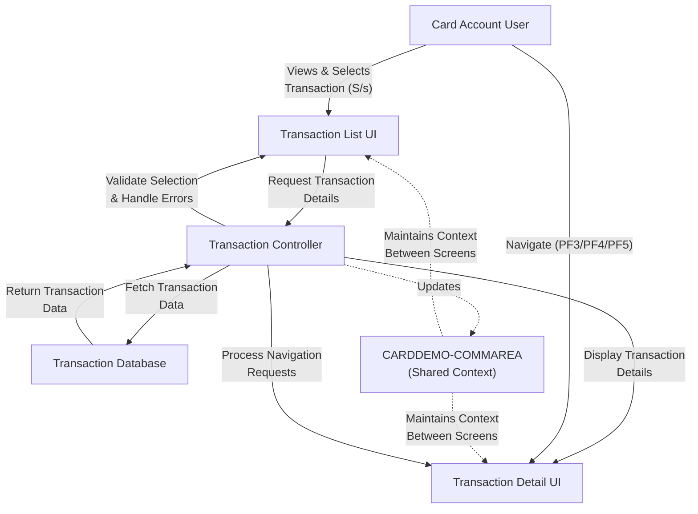

# View Transaction Details

## User Story
_As a card account user, I want to select and view detailed information about specific transactions from my transaction list, so that I can review complete transaction information and verify my account activity._

## Acceptance Criteria
1. GIVEN I am viewing my transaction list WHEN I enter 'S' or 's' next to a transaction THEN the system should display the detailed information for that specific transaction
2. GIVEN I am viewing my transaction list WHEN I enter any character other than 'S' or 's' in the selection field THEN the system should display an error message 'Invalid selection. Valid value is S'
3. GIVEN I am viewing the transaction detail screen WHEN I press PF3 THEN the system should return me to the previous screen
4. GIVEN I am viewing the transaction detail screen WHEN I press PF4 THEN the system should clear the current screen
5. GIVEN I am viewing the transaction detail screen WHEN I press PF5 THEN the system should navigate to the transaction list screen
6. GIVEN I am viewing the transaction detail screen WHEN a transaction ID is not found in the database THEN the system should display the error message 'Transaction ID NOT found...'
7. GIVEN I am viewing the transaction detail screen WHEN I attempt to view details with an empty transaction ID THEN the system should display the error message 'Tran ID can NOT be empty...'
8. System should display comprehensive transaction details including card number, transaction type, category, amount (with proper currency formatting), description, timestamps, and merchant information
9. System should maintain context between screens through the shared CARDDEMO-COMMAREA communication area

## Test Scenarios
1. Verify that a transaction's complete details are displayed when a user selects a transaction with 'S' from the list
2. Verify that an error message is displayed when a user enters an invalid selection character
3. Confirm navigation works correctly when using PF3 to return to previous screen, PF4 to clear screen, and PF5 to access transaction list
4. Validate that transaction amounts are properly formatted with currency symbols and decimal places
5. Verify appropriate error messages are displayed when attempting to view details for non-existent transaction IDs
6. Verify appropriate error messages are displayed when attempting to view details with an empty transaction ID
7. Confirm that all transaction details (card number, transaction type, category, amount, description, timestamps, merchant information) are correctly retrieved and displayed
8. Validate that context is maintained when navigating between transaction list and transaction detail screens
9. Verify that the system correctly handles database access errors with appropriate error messages

## Diagram

## Subtasks
### Transaction Selection
This subtask enables users to select a specific transaction from the displayed list for detailed viewing. Users can enter 'S' or 's' in the selection field next to any transaction in the list. When a transaction is selected, the system captures the selection in CDEMO-CT00-TRN-SEL-FLG and stores the selected transaction ID in CDEMO-CT00-TRN-SELECTED. The system validates the selection input, accepting only 'S' or 's' as valid values and displaying an error message ('Invalid selection. Valid value is S') for any other input. Upon valid selection, the system transfers control to program COTRN01C, which displays detailed information about the selected transaction. This subtask maintains context between screens through the shared CARDDEMO-COMMAREA communication area, ensuring the user can navigate back to the transaction list after viewing details.
#### References
- [COTRN00C](/COTRN00C.md)
### Transaction Detail Retrieval
This subtask retrieves and displays detailed information about a specific transaction from the TRANSACT file. When a user enters a transaction ID, the system performs a lookup in the TRANSACT database and displays comprehensive transaction details including card number, transaction type, category, amount, description, timestamps, and merchant information. Business rules include: 1) Transaction ID is required and cannot be empty (validation enforced with error message 'Tran ID can NOT be empty...'); 2) The transaction must exist in the database (error message 'Transaction ID NOT found...' is displayed if not found); 3) The system formats and displays transaction amount with proper currency formatting (converting from internal numeric format to display format); 4) The system provides navigation options to return to previous screens (PF3), clear the current screen (PF4), or access the transaction list screen (PF5). Error handling includes specific messages for empty input, record not found conditions, and general database access errors. This component depends on the TRANSACT file for data retrieval and integrates with other components like COTRN00C (transaction list) and COMEN01C (menu screen) for navigation.
#### References
- [COTRN01C](/COTRN01C.md)